# Next.js 16 Data Fetching — Server Components, not Server Actions in useEffect

## Scope — Next.js 16 App Router only

This skill applies **only to Next.js 16 App Router projects**. Before applying any rule below, confirm the target codebase actually is one:

- `package.json` has `"next": "^16…"` (or a 16.x range / git ref resolving to 16) **and**
- routes live under `app/` (App Router), not `pages/` (Pages Router).

**If the project is anything else, refuse to apply this skill** and say so explicitly:

- Pages Router (`pages/` directory) — different mental model: `getServerSideProps` / `getStaticProps` / API routes / SWR. The Server Component / Server Action / `revalidatePath` machinery does not exist there. Do not apply.
- Next.js 15 or earlier — APIs and defaults differ; `searchParams` is sync, `refresh()` is not in `next/cache`, cache semantics changed. Do not apply.
- Any other framework (Remix, SvelteKit, Astro, Vite + React, RedwoodJS, plain React, etc.) — the entire premise (RSC + Server Actions) doesn't transfer. Do not apply.
- Mixed monorepo where some apps are 16/App-Router and some aren't — apply only inside the matching app directory.

State the mismatch plainly ("This file is in `pages/`, so the `nextjs-data-fetching` skill doesn't apply — Pages Router uses different primitives") and stop. Don't translate the patterns to a foreign framework.

## Companion skill — install and follow `no-use-effect`

This skill **never recommends `useEffect`**. Every code path here either avoids it entirely or routes through the project's `useMountEffect` helper. If you don't already have it, install the `no-use-effect` skill alongside this one — it owns the broader React-side rule (derive state, use a query library, use event handlers, use `key` to reset, use `useMountEffect` for one-time external sync) and it owns the lint rule (`no-restricted-syntax` banning bare `useEffect`).

If you find a green example below that _looks_ like it would have been a `useEffect` in older code, that's the point — it isn't one anymore. The `❌` red blocks below show `useEffect` only because that's what the anti-pattern actually looks like in the wild; never copy from a red block.

## The Rule

**Read data in Server Components. Mutate data with Server Actions. Never use `useEffect` (or `useState + useEffect`) in a Client Component to call a Server Action just to load data.**

This applies to every Next.js 16 App Router project, including `apps/manager/`. Violating it costs streaming, caching, request deduping, and turns one render into a sequential client-side waterfall.

**Violating the letter of this rule is violating the spirit.** The framework lets you call a `"use server"` function from a Client Component — that's a capability, not a license. The signal that you've drifted is not a runtime error (there is none), it's the patterns below: a `getX` action, a `useEffect` that fetches, a page newly converted to `"use client"`. **The bug is silent: no error, no warning, just worse UX, wasted POSTs, no streaming, no cache.** The absence of a stack trace is not the absence of a problem.

## Why

Per the official Next.js docs:

> "Server Functions are designed for server-side **mutations**, and the client currently dispatches and awaits them **one at a time**. […] If you need parallel data fetching, use data fetching in Server Components."
> — `docs/01-app/01-getting-started/07-mutating-data.mdx`

> "Server Actions are queued, and using them for data fetching introduces sequential execution."
> — `docs/01-app/02-guides/backend-for-frontend.mdx`

Concretely, a `useEffect`-driven Server Action read costs you:

- **No SSR** — the page paints empty, then fetches after hydration. Worst LCP.
- **Sequential queue** — every Server Action call waits on the previous one. No parallelism.
- **No request deduping / caching** — Server Actions always POST; React's request cache, `fetch` cache, and `unstable_cache` don't apply.
- **No streaming** — you can't progressively render with `<Suspense>`.
- **Double-fetch on mount** in Strict Mode dev.
- **Larger client bundle** — fetch logic, loading states, error states all ship to the browser.

## Decision: how to load data

The first question is **not** "where does the data need to land?" — it's "**why is this a Client Component at all?**" Most reads belong on the server. If the answer is anything weaker than "polling, focus refetch, or a third party mutates the data without user intent," the fix is to lift the read to a Server Component, not to swap the transport.

```dot
digraph data_fetching {
  "Why is this a Client Component?" [shape=diamond];
  "Server Component, await directly" [shape=box];
  "URL searchParams; page stays Server Component" [shape=box];
  "Promise<T> from Server Component, use() in Client leaf" [shape=box];
  "Route Handler GET + SWR / React Query (last resort)" [shape=box];

  "Why is this a Client Component?" -> "Server Component, await directly" [label="It isn't / shouldn't be"];
  "Why is this a Client Component?" -> "URL searchParams; page stays Server Component" [label="Filter / tab / range state"];
  "Why is this a Client Component?" -> "Promise<T> from Server Component, use() in Client leaf" [label="Genuine interactivity at the data boundary, initial data only"];
  "Why is this a Client Component?" -> "Route Handler GET + SWR / React Query (last resort)" [label="Polling, focus refetch, or third-party mutates the data"];
}
```



**The branches are not peers.** Top to bottom: Server Component (default, ~90% of cases), URL state (most "I need filters" cases), `use()` + `<Suspense>` (rare — Client Component genuinely needs data as props at mount), Route Handler + SWR (last resort, narrow scope). Reaching for the bottom branch when an upper branch fits is the most common failure mode of this skill.

**Server Actions are for mutations only.** The only legitimate "action call from a button" that returns data is a follow-up to a user-initiated mutation (e.g., a form submission that returns the new record).

## Migrating away from `useEffect` + Server Action — the ladder

If you're staring at `useState` + `useEffect` + a `"use server"` read in a Client Component, walk this ladder **top-down** and stop at the first rung that fits. It's almost always rung 1. The most common failure mode of this skill is skipping rungs 1–3 and landing on rung 4 because it's the smallest physical diff.

1. **Lift the read to a Server Component.** Convert the page to `async function Page({ searchParams })`, `await` the read at the top, pass data down. If the page has interactive state, ask rung 2 _before_ deciding it has to stay client.
2. **Move state to URL `searchParams`.** Tabs, filters, ranges, pagination, sort, search query — all belong in the URL. The Client leaf calls `router.replace`; the Server Component re-renders with new data. The page stays a Server Component. Free streaming, free cache, shareable URL, back-button works.
3. **Pass `Promise<T>` from Server Component, consume with `use()` + `<Suspense>`.** Only when a Client Component genuinely needs server data as props at mount (charting libraries, third-party widgets that expect a synchronous data shape). Page stays a Server Component; only the interactive leaf is `"use client"`.
4. **`GET` Route Handler + SWR / React Query.** Reserved for: interval polling, focus revalidation, or a third party mutates the data outside your app. **Not** for "I already have a Client Component and want to keep it."

### The lateral migration is the failure mode

`useEffect` + action → `useSWR` + Route Handler in the same Client Component is the wrong refactor. It feels like progress — no more action-as-read — but:

- The page is still `"use client"`. No SSR, no streaming, same bad LCP.
- You traded a sequential POST queue for a sequential `fetch`. Same waterfall.
- "Route Handlers cache!" — not for per-user, per-org reads. Your `/api/cases` is `Cache-Control: private`; the CDN won't touch it; SWR dedups within one tab, not across users.
- You added a network hop, a JSON serialization layer, a client library, and an extra route file — for zero cache wins over the Server Component you should have written.

If you reached rung 4 without first asking "can this page simply be a Server Component?", you took the wrong rung. Back up.

## The four correct patterns

### 1. Async Server Component — the default

```tsx
// app/(platform)/cases/page.tsx
import { listCases } from "@/lib/services/case.service";

export default async function CasesPage() {
  const cases = await listCases();
  return <CasesTable cases={cases} />;
}
```

Use this whenever the data is needed for the initial render. No `"use client"`, no `useEffect`, no Server Action.

### 2. Stream a promise to a Client Component with `use()` + `<Suspense>`

When a Client Component (because of interactivity) needs server-fetched data on first render:

```tsx
// app/(platform)/cases/page.tsx — Server Component
import { Suspense } from "react";
import { listCases } from "@/lib/services/case.service";
import CasesTable from "./cases-table"; // Client Component

export default function CasesPage() {
  const casesPromise = listCases(); // do NOT await

  return (
    <Suspense fallback={<CasesTableSkeleton />}>
      <CasesTable casesPromise={casesPromise} />
    </Suspense>
  );
}
```

```tsx
// cases-table.tsx
"use client";
import { use } from "react";
import type { Case } from "@hive/types";

export default function CasesTable({ casesPromise }: { casesPromise: Promise<Case[]> }) {
  const cases = use(casesPromise); // suspends until resolved
  // …interactive UI
}
```

The Server Component starts the fetch, streams HTML as soon as it can, and the Client Component hydrates with the resolved value. No client-side waterfall.

### 3. Server Action — only for mutations, invoked via `<form>` or event handler after user intent

```tsx
"use server";
export async function archiveCase(id: string) {
  await db.update(cases).set({ archivedAt: new Date() }).where(eq(cases.id, id));
  revalidatePath("/cases");
}
```

After the mutation, call `revalidatePath` / `revalidateTag` and let the Server Component re-render with fresh data. Don't return a list to refresh client state by hand.

### 4. Route Handler + SWR / React Query — last resort, narrow scope

**Reach for this only when the data genuinely changes without user intent**: interval polling, focus revalidation, or a third party mutates the data outside your app. Anything else — initial data, post-mutation refresh, filter / tab / range state — belongs in patterns 1–3.

This is the _last resort_, not a peer of patterns 1–3. For per-user, per-org reads (almost everything in this project), "Route Handlers participate in HTTP caching" doesn't cash out: your route is `Cache-Control: private`, the CDN doesn't cache it, and SWR's dedup/focus-revalidation only helps within a single browser tab. You're paying for a network hop, a JSON layer, and a client library to land where a Server Component already started.

```ts
// app/api/dashboard/stats/route.ts — only because the dashboard polls every 5s
import { NextResponse } from "next/server";
import { getDashboardStats } from "@/lib/services/dashboard.service";

export async function GET(req: Request) {
  const range = new URL(req.url).searchParams.get("range") ?? "30d";
  return NextResponse.json(await getDashboardStats(range));
}
```

```tsx
"use client";
import useSWR from "swr";
const fetcher = (u: string) => fetch(u).then((r) => r.json());

export function LiveStats({ range }: { range: string }) {
  const { data } = useSWR(`/api/dashboard/stats?range=${range}`, fetcher, {
    refreshInterval: 5_000,
  });
  return; /* … */
}
```

If your Client Component doesn't poll, doesn't refetch on focus, and isn't watching externally-mutated data, **you don't need this**. Walk back up the migration ladder.

## Anti-pattern catalog — red ❌ → green ✅

Each pair is verified against the Next.js 16 App Router docs. Sources cited inline.

### 1. Reading data via a Server Action in `useEffect`

❌ **Red — sequential POST queue, no SSR, no streaming, no cache, double-fetch in dev Strict Mode:**

```tsx
"use client";
import { useEffect, useState } from "react";
import { getCases } from "@/lib/actions/cases.actions"; // "use server"

export default function CasesPage() {
  const [cases, setCases] = useState<Case[]>([]);
  useEffect(() => {
    getCases().then(setCases);
  }, []);
  return <CasesTable cases={cases} />;
}
```

✅ **Green — async Server Component, fetch on the server, stream HTML:**

```tsx
// app/(platform)/cases/page.tsx
import { listCases } from "@/lib/services/case.service";

export default async function CasesPage() {
  const cases = await listCases();
  return <CasesTable cases={cases} />;
}
```

> _"Server Functions are designed for server-side **mutations**, and the client currently dispatches and awaits them **one at a time**. […] If you need parallel data fetching, use data fetching in Server Components."_ — `docs/01-app/01-getting-started/07-mutating-data.mdx`

**No `useEffect` — ever.** Even the rare "fire a mutation on mount" case (e.g., a view counter that calls a Server Action when the page loads) does **not** use `useEffect` here. Per the `no-use-effect` skill, that's `useMountEffect` — the project's escape-hatch helper that wraps `useEffect(fn, [])` with explicit intent and a single eslint-disable in one place:

```tsx
"use client";
import { useMountEffect } from "@/lib/hooks/use-mount-effect";
import { incrementViews } from "@/lib/actions/views.actions"; // "use server" — a real mutation

export function ViewCounter() {
  useMountEffect(() => {
    incrementViews();
  });
  return null;
}
```

Even with `useMountEffect`, ask first: does this need to run on the client at all? A view increment can usually run inside the page Server Component (no client component, no hook). Reach for `useMountEffect` only when you genuinely need a browser-side trigger (DOM API, third-party widget, focus management).

---

### 2. Filter / tab / range state in `useState`, refetched via Server Action

❌ **Red — page becomes a Client Component to host the filter state; every chip click hits a queued POST:**

```tsx
"use client";
import { useEffect, useState } from "react";
import { getCases } from "@/lib/actions/cases.actions";

export default function CasesPage() {
  const [status, setStatus] = useState<"open" | "closed">("open");
  const [cases, setCases] = useState<Case[]>([]);
  useEffect(() => {
    getCases({ status }).then(setCases);
  }, [status]);
  return; /* filters + table */
}
```

✅ **Green — filter state lives in the URL `searchParams`; the Server Component re-renders with fresh data; the URL is shareable and the back button works:**

```tsx
// app/(platform)/cases/page.tsx — Server Component
import { listCases } from "@/lib/services/case.service";
import { CasesFilters } from "./cases-filters";

export default async function CasesPage({ searchParams }: { searchParams: Promise<{ status?: string }> }) {
  const { status = "open" } = await searchParams;
  const cases = await listCases({ status });
  return (
    <>
      <CasesFilters value={status} />
      <CasesTable cases={cases} />
    </>
  );
}
```

```tsx
// cases-filters.tsx — small Client Component, pushes to URL
"use client";
import { usePathname, useRouter, useSearchParams } from "next/navigation";

export function CasesFilters({ value }: { value: string }) {
  const router = useRouter();
  const pathname = usePathname();
  const sp = useSearchParams();
  const set = (status: string) => {
    const next = new URLSearchParams(sp);
    next.set("status", status);
    router.replace(`${pathname}?${next}`, { scroll: false });
  };
  return; /* chips that call set(...) */
}
```

> Server Components receive `searchParams` as an async prop; changing the URL re-runs the Server Component on the server. — `docs/01-app/01-getting-started/06-fetching-data.mdx` (page params/searchParams).

---

### 3. Manually re-running a read after a mutation

❌ **Red — reach for `setState` after every mutation, ship list-management code to the client:**

```tsx
"use client";
import { listCases, deleteCase } from "@/lib/actions/cases.actions";

export function CasesList() {
  const [cases, setCases] = useState<Case[]>([]);
  useEffect(() => {
    listCases().then(setCases);
  }, []);

  async function handleDelete(id: string) {
    await deleteCase(id);
    const fresh = await listCases(); // 2nd POST, sequential, no cache
    setCases(fresh);
  }
  /* … */
}
```

✅ **Green — mutate, call `revalidatePath` / `revalidateTag` / `refresh` inside the action; the Server Component re-renders with fresh data:**

```ts
// lib/actions/cases.actions.ts
"use server";
import { revalidatePath } from "next/cache";
import { requireOrgPermission } from "@/lib/auth";
import { deleteCase as deleteCaseService } from "@/lib/services/case.service";

export async function deleteCaseAction(id: string) {
  await requireOrgPermission("org:cases:delete");
  await deleteCaseService(id);
  revalidatePath("/cases");
}
```

```tsx
// delete-case-button.tsx — minimal Client Component
"use client";
import { useTransition } from "react";
import { deleteCaseAction } from "@/lib/actions/cases.actions";

export function DeleteCaseButton({ id }: { id: string }) {
  const [pending, start] = useTransition();
  return (
    <button disabled={pending} onClick={() => start(() => deleteCaseAction(id))}>
      {pending ? "Deleting…" : "Delete"}
    </button>
  );
}
```

> _"This ensures the UI displays the latest data after the mutation completes."_ — `docs/01-app/01-getting-started/07-mutating-data.mdx` on `revalidatePath`.

**Three variants — pick the narrowest one that does the job:**

- `revalidatePath('/cases')` — invalidate by route segment.
- `revalidateTag('cases')` — invalidate by tag (use when a service uses `fetch(..., { next: { tags: ['cases'] } })` or React's `cache()` with tags).
- `refresh()` from `next/cache` — inside a Server Action, refresh the client router cache for the current route. Useful when the mutation happens on the same page and you don't want to enumerate paths/tags.

---

### 4. `"use server"` file containing read-only `getX` / `listX` / `findX`

❌ **Red — Server Action whose only job is to `SELECT`. Inviting future code to call it from `useEffect`:**

```ts
// lib/actions/cases.actions.ts
"use server";
import { db } from "@/lib/db";
import { cases } from "@/lib/db/schema";

export async function getCases() {
  return db.select().from(cases);
}
```

✅ **Green — read logic lives in `lib/services/`, called directly from Server Components. Actions wrap services _for mutations only_:**

```ts
// lib/services/case.service.ts
import { db } from "@/lib/db";
import { cases } from "@/lib/db/schema";
import { requireOrgPermission } from "@/lib/auth";

export async function listCases(filters: CaseFilters = {}) {
  await requireOrgPermission("org:cases:read");
  return db.select().from(cases).where(/* … */);
}
```

```tsx
// app/(platform)/cases/page.tsx
import { listCases } from "@/lib/services/case.service";
export default async function Page() {
  const cases = await listCases();
  return <CasesTable cases={cases} />;
}
```

The service stays the single source of truth. Mutation actions in `lib/actions/` import the service for the write side. No duplication, clear responsibilities.

---

### 5. Promise-awaited then handed to a Client Component, blocking streaming

❌ **Red — `await` in the parent forces the whole subtree to wait before any HTML streams:**

```tsx
import { listCases } from "@/lib/services/case.service";
import CasesTable from "./cases-table"; // "use client"

export default async function Page() {
  const cases = await listCases(); // entire page waits
  return <CasesTable cases={cases} />;
}
```

✅ **Green — pass the unawaited `Promise<T>`; consume with `use()` + `<Suspense>` so the shell streams immediately:**

```tsx
// app/(platform)/cases/page.tsx — Server Component
import { Suspense } from "react";
import { listCases } from "@/lib/services/case.service";
import CasesTable from "./cases-table";

export default function Page() {
  const casesPromise = listCases(); // do NOT await
  return (
    <Suspense fallback={<CasesTableSkeleton />}>
      <CasesTable casesPromise={casesPromise} />
    </Suspense>
  );
}
```

```tsx
// cases-table.tsx
"use client";
import { use } from "react";

export default function CasesTable({ casesPromise }: { casesPromise: Promise<Case[]> }) {
  const cases = use(casesPromise);
  return; /* interactive UI */
}
```

> _"You can use React's `use` API to stream data from the server to client. […] The Client Component should be wrapped in a `<Suspense>` boundary, which displays a fallback while the promise is being resolved."_ — `docs/01-app/01-getting-started/06-fetching-data.mdx`

---

### 6. Optimistic UI built with manual `useState` + Server Action read-back

❌ **Red — bookkeeping the "real" state by hand, easy to desync:**

```tsx
"use client";
import { useState } from "react";
import { sendMessage, listMessages } from "@/lib/actions/chat.actions";

export function Thread({ initial }: { initial: Message[] }) {
  const [msgs, setMsgs] = useState(initial);
  async function onSend(text: string) {
    setMsgs((m) => [...m, { text, pending: true }]);
    await sendMessage(text);
    setMsgs(await listMessages()); // re-read via Server Action — anti-pattern #1
  }
  /* … */
}
```

✅ **Green — `useOptimistic`; the action does the mutation + `revalidatePath`, the optimistic value bridges the gap:**

```tsx
"use client";
import { useOptimistic } from "react";
import { sendMessage } from "@/lib/actions/chat.actions";

export function Thread({ messages }: { messages: Message[] }) {
  const [optimistic, addOptimistic] = useOptimistic<Message[], string>(messages, (state, text) => [
    ...state,
    { text, pending: true },
  ]);

  async function formAction(formData: FormData) {
    const text = formData.get("text") as string;
    addOptimistic(text);
    await sendMessage(text); // server-side mutation + revalidatePath
  }

  return (
    <>
      {optimistic.map((m, i) => (
        <div key={i}>{m.text}</div>
      ))}
      <form action={formAction}>{/* … */}</form>
    </>
  );
}
```

> _"`useOptimistic` enables immediate UI updates before a server action completes."_ — `docs/01-app/02-guides/forms.mdx`. Source of truth stays on the server; the optimistic state is purely local UI bridge.

---

### 7. Polling / interval-refetch via Server Action

This is the **only** anti-pattern in this section whose `✅` solution is pattern 4 (Route Handler + SWR), and only because the Red genuinely polls. If your `useEffect` + action just runs once at mount to load data, the Green for _that_ case is pattern 1 (Server Component) or pattern 2 (`Promise<T>` + `use()`) — **not** this one. Don't grab this code as the template for migrating any `useEffect` + action to SWR.

❌ **Red — Server Actions are queued and uncached, polling them serializes the whole page:**

```tsx
"use client";
useEffect(() => {
  const id = setInterval(async () => {
    setStats(await getDashboardStats()); // queue grows on every tick
  }, 5_000);
  return () => clearInterval(id);
}, []);
```

✅ **Green — only because this genuinely polls every 5s. `GET` Route Handler + SWR / React Query:**

```ts
// app/api/dashboard/stats/route.ts
import { NextResponse } from "next/server";
import { getDashboardStats } from "@/lib/services/dashboard.service";

export async function GET(req: Request) {
  const range = new URL(req.url).searchParams.get("range") ?? "30d";
  const stats = await getDashboardStats(range);
  return NextResponse.json(stats);
}
```

```tsx
"use client";
import useSWR from "swr";
const fetcher = (u: string) => fetch(u).then((r) => r.json());

export function LiveStats({ range }: { range: string }) {
  const { data } = useSWR(`/api/dashboard/stats?range=${range}`, fetcher, {
    refreshInterval: 5_000,
  });
  return; /* … */
}
```

The honest claim: Server Actions are queued, single-flight, can't be cancelled, and have no dedup. For _genuine_ polling they're worse than Route Handlers — that's the whole reason this pattern exists. The "Route Handlers cache!" framing oversells: per-user reads are `Cache-Control: private`, CDN-uncacheable, and SWR's dedup applies only within one tab.

---

### 8. Page made `"use client"` "because I need state for the UI"

❌ **Red — moving the whole page to the client to get a single piece of interactive state:**

```tsx
"use client"; // entire page is now a Client Component
import { useState } from "react";

export default function CasesPage() {
  const [tab, setTab] = useState("open");
  /* fetches via useEffect, etc. */
}
```

✅ **Green — keep the page as a Server Component; isolate the interactive bit in a small Client Component child:**

```tsx
// app/(platform)/cases/page.tsx — Server Component
import { listCases } from "@/lib/services/case.service";
import { TabBar } from "./tab-bar"; // "use client", pushes ?tab=… to URL

export default async function CasesPage({ searchParams }: { searchParams: Promise<{ tab?: string }> }) {
  const { tab = "open" } = await searchParams;
  const cases = await listCases({ tab });
  return (
    <>
      <TabBar value={tab} />
      <CasesTable cases={cases} />
    </>
  );
}
```

The default for every new page should be Server Component. Add `"use client"` to the smallest leaf that needs interactivity, never to the page itself.

## Quick reference

| You want to…                                                                                        | Use                                                                                                     |
| --------------------------------------------------------------------------------------------------- | ------------------------------------------------------------------------------------------------------- |
| Initial page data                                                                                   | Async Server Component (`await` at top of component)                                                    |
| Filter / tab / range / pagination / search state                                                    | URL `searchParams` — page stays a Server Component; the Client leaf calls `router.replace`              |
| Initial data inside an interactive (Client) component                                               | Pass `Promise<T>` from Server Component, `use()` + `<Suspense>`                                         |
| Mutate (insert/update/delete)                                                                       | Server Action (`"use server"`), invoked via `<form>` or event handler                                   |
| Refresh data after mutation                                                                         | `revalidatePath` / `revalidateTag` inside the Server Action — do NOT manually refetch into client state |
| Refetch on interval / focus / external mutation (last resort — not for "I have a Client Component") | Route Handler `GET` + SWR or React Query                                                                |

## Red flags — STOP and switch pattern

If you catch yourself writing or approving any of these, stop:

- `useEffect(() => { someServerAction().then(setX) }, [])`
- `useState<T[]>([])` + `useEffect` that calls a `"use server"` function
- `"use server"` file containing functions named `get*`, `list*`, `find*`, `fetch*`, `load*`, `read*`
- A page, layout, or template converted to `"use client"` because "I need state for the filters"
- Manually re-running a `listX`/`getX` action after a mutation instead of `revalidatePath` / `revalidateTag`
- Two or more Server Action calls inside the same effect or event handler (guaranteed sequential)
- Filter/range/tab state in `useState` + a Server Action refetch on change (use URL `searchParams` instead — they trigger a Server Component re-render, no client refetch needed)
- Adding a Suspense `key={range}` and a Server Component that re-runs is **good**; adding a Suspense `key` so a `useEffect` fires again is the wrong pattern with a new wrapper
- **Migrating `useEffect` + Server Action to `useSWR` + `GET /api/…` Route Handler in the same Client Component, without first asking whether the page could simply be a Server Component.** This is _the_ most common failure mode of this skill — it feels like progress, but the page stays `"use client"`, the waterfall stays, the LCP stays bad, and you've added a network hop and a client library for nothing. Walk the migration ladder.
- Introducing a `GET /api/x` Route Handler to feed `useSWR` in a page that has no genuine reason to be `"use client"` — no polling, no focus refetch, no third-party data source. The page wants to be a Server Component; let it.
- `useSWR` whose only `refreshInterval` / `revalidateOnFocus` config is the default (off) — i.e., it's only ever loading once. That's not what SWR is for; pass `Promise<T>` from a Server Component and `use()` it instead.

## Common rationalizations and the honest answer

These are the exact excuses observed under deadline pressure. Every one is wrong here.

| Excuse                                                                                | Reality                                                                                                                                                                                                                                                                                                                                                                                                                                                                                                                                                                 |
| ------------------------------------------------------------------------------------- | ----------------------------------------------------------------------------------------------------------------------------------------------------------------------------------------------------------------------------------------------------------------------------------------------------------------------------------------------------------------------------------------------------------------------------------------------------------------------------------------------------------------------------------------------------------------------- |
| "Server Actions _can_ be called from clients, so this is technically allowed."        | Capability ≠ license. The framework also lets you `fetch('/api/...')` in `getServerSideProps` — both compile, both ship, both are wrong. Spirit: actions mutate, components read.                                                                                                                                                                                                                                                                                                                                                                                       |
| "It works in dev, there's no error."                                                  | The bug is silent by design — no warning, no stack trace. Symptoms are LCP regression, double-mount POSTs, sequential queue, no cache, no streaming. Absence of an error is not a green light.                                                                                                                                                                                                                                                                                                                                                                          |
| "It's internal-only / no SEO impact / will be redesigned in 2 months."                | "Temporary" code becomes permanent. The right pattern is not slower to write once you know it — RSC + `searchParams` is fewer lines than `useState`+`useEffect`+loading state+error state.                                                                                                                                                                                                                                                                                                                                                                              |
| "Senior teammate said it's fine" / "the tutorial does it this way."                   | Many tutorials predate App Router or are about Pages Router. The Next.js 16 docs explicitly warn: _"Server Actions are queued, and using them for data fetching introduces sequential execution."_ Cite the docs, not the teammate.                                                                                                                                                                                                                                                                                                                                     |
| "It's the smallest diff for this PR."                                                 | Minimum-diff is not minimum-debt. A diff that introduces the anti-pattern is bigger than the diff that converts the page to a Server Component, because you'll pay it back later — usually with a regression.                                                                                                                                                                                                                                                                                                                                                           |
| "Server Actions are just async functions."                                            | They are RPC endpoints. Each call is a `POST` round-trip with no caching, no request deduping, no React `cache()` integration, and the client awaits them serially. They are not "just functions."                                                                                                                                                                                                                                                                                                                                                                      |
| "I already have the action, why duplicate it as a service?"                           | The reusable unit lives in `lib/services/`. The action in `lib/actions/` is a thin wrapper that adds `requirePermission` + Zod validation + `createAuditLog` + `revalidatePath` for **mutations**. Server Components import the service directly. No duplication — different responsibilities.                                                                                                                                                                                                                                                                          |
| "I need it in a Client Component for interactivity / filters / tabs."                 | Interactivity ≠ client-side fetching. Put filter state in URL `searchParams` (the Client Component pushes via `router.replace`); the Server Component re-renders with fresh data. For data the Client Component needs at mount, pass `Promise<T>` from the parent Server Component and consume with `use()`.                                                                                                                                                                                                                                                            |
| "I need to refetch after a mutation."                                                 | Mutation calls `revalidatePath` / `revalidateTag` and the Server Component re-renders automatically. Do not return data from the action and `setState` it into the client.                                                                                                                                                                                                                                                                                                                                                                                              |
| "I need to refetch on a timer / on focus / when an external system mutates the data." | That's the one case for SWR or React Query — pointed at a `GET` Route Handler. Not a Server Action. (Note: a Suspense `key` change does **not** count — that already re-runs the Server Component, no SWR needed.)                                                                                                                                                                                                                                                                                                                                                      |
| "I migrated to SWR + Route Handler — that's the recommended pattern."                 | SWR + Route Handler is the **last** recommended pattern, not the **first**. The migration ladder for `useEffect` + action starts at "make the page a Server Component" and only reaches SWR if the data genuinely polls, refetches on focus, or is mutated by an external system. Skipping rungs 1–3 because rung 4 is the smallest physical diff is the failure mode this skill is trying to prevent. If your `useSWR` has no `refreshInterval` and no `revalidateOnFocus`, you wrote a Client Component that loads once — exactly what `Promise<T>` + `use()` is for. |
| "But useEffect + action was the anti-pattern, and SWR fixes it."                      | SWR doesn't fix the page being `"use client"` when it shouldn't be. It just hides the same client-side waterfall behind a different API. The anti-pattern wasn't "Server Action over fetch"; it was "loading initial data on the client at all."                                                                                                                                                                                                                                                                                                                        |
| "URL searchParams are awkward / I don't want them in the URL."                        | Use the URL anyway. Shareable, bookmarkable, back-button works, no client/server state divergence, free Server Component re-render. The "ugliness" is a smaller cost than every alternative.                                                                                                                                                                                                                                                                                                                                                                            |
| "Server Actions and Route Handlers both POST/GET, same wire cost."                    | True — and that's the point. For _initial-load_ data, the right answer isn't "swap Server Action for Route Handler," it's "don't load on the client at all." The Route Handler advantage (HTTP cache, dedup, conditional requests, CDN) only cashes out for **public, cacheable** URLs; per-user/per-org reads are `Cache-Control: private` and the CDN won't touch them. Reach for Route Handler + SWR only when you genuinely poll or refetch on focus.                                                                                                               |
| "It's not my PR — refactoring is scope creep."                                        | Approving the wrong primitive is approving permanent debt. Block, link this skill, ask for the Server Component version. That's the review's job.                                                                                                                                                                                                                                                                                                                                                                                                                       |
| "Optimistic UI needs client state."                                                   | `useOptimistic` gives you optimistic UI **without** moving the source of truth to the client. The action still mutates and `revalidatePath`s; the optimistic value bridges the gap.                                                                                                                                                                                                                                                                                                                                                                                     |
| "Other code in this project does it this way."                                        | Other code is wrong. Don't propagate it. Add a TODO if you don't have time to refactor right now, but don't start a new file with the same anti-pattern.                                                                                                                                                                                                                                                                                                                                                                                                                |
| "I'll fix it later."                                                                  | You won't. The PR you're writing now is the cheapest moment to do it right.                                                                                                                                                                                                                                                                                                                                                                                                                                                                                             |

## Audit

When the user asks to **audit** a codebase against this skill (phrasings: "audit my codebase against nextjs-data-fetching", "/audit-data-fetching", "scan for data-fetching anti-patterns", "find violations of the data-fetching rules"), follow this recipe. Do not modify code during the audit — produce a report only. Offer to fix issues afterwards.

### Step 1 — confirm scope

Run scope checks first; if they fail, abort the audit and tell the user why:

- `package.json` has `"next": "^16…"` (or 16.x range).
- Routes live under `app/`, not `pages/`.

If the project is mixed (some apps on App Router, some on Pages), narrow the audit to the App Router app(s) and say so in the report.

### Step 2 — scan for the eight anti-patterns

Run these greps in parallel from the project root. Each maps to one of the numbered anti-patterns in this skill. Use ripgrep where available; fall back to `grep -rn`.

```bash
# 1. useEffect calling a Server Action / async fetch in a Client Component
rg -n --type=tsx --type=ts -B1 -A8 'useEffect\s*\(' \
  -g '!node_modules' -g '!.next' \
  | rg -B2 -A1 -e 'await\s+\w+\(' -e '\.then\(' -e 'fetch\('

# 2. Filter/tab state in useState that triggers a re-fetch
rg -n --type=tsx --type=ts -e 'useState.*(?:filter|tab|range|sort|page)' \
  -g '!node_modules' -g '!.next'

# 3. Manual setState refresh after a mutation (look near server-action call sites)
rg -n --type=tsx --type=ts -B2 -A6 -e 'await\s+\w+Action\(' -e "from\s+['\"]@/lib/actions" \
  -g '!node_modules' -g '!.next' \
  | rg -B4 -A2 -e 'setState\(' -e 'set[A-Z]\w+\('

# 4. Read-only functions exported from "use server" files
rg -n --type=ts -B3 -A1 -e '^\s*export\s+(async\s+)?function\s+(get|list|find|fetch|load|search)[A-Z]' \
  $(rg -l --type=ts '"use server"' -g '!node_modules' -g '!.next' 2>/dev/null) 2>/dev/null

# 5. Awaited promises passed as props to Client children (blocks streaming)
#    Heuristic: server component awaits, then renders a "use client" component with the awaited value.
rg -n --type=tsx -B1 -A6 -e '^\s*const\s+\w+\s*=\s*await\s+' \
  -g '!node_modules' -g '!.next'

# 6. useState + Server Action read-back instead of useOptimistic
rg -n --type=tsx -B2 -A8 -e 'useState' \
  -g '!node_modules' -g '!.next' \
  | rg -B4 -A4 -e 'Action\(' \
  | rg -v 'useOptimistic'

# 7. Polling via setInterval/setTimeout calling a Server Action or async read
rg -n --type=tsx --type=ts -B1 -A6 -e 'setInterval\(' -e 'setTimeout\(.*,\s*\d{4,}' \
  -g '!node_modules' -g '!.next'

# 8. Pages or layouts marked "use client" at the top level
rg -ln --type=tsx '^"use client"' app/ \
  | rg -e '/page\.tsx$' -e '/layout\.tsx$' -e '/template\.tsx$'
```

For findings under `lib/actions/`, additionally inspect each file: any function whose body is a single `select` / `findMany` / `findUnique` / `service.list*` / `service.get*` call is a **Pattern 4** violation regardless of name.

### Step 3 — produce the report

Produce a markdown report grouped by anti-pattern (1 through 8). For each finding, include:

- File path and line number (clickable: `path/to/file.tsx:42`).
- A 3–5 line excerpt showing the offending code.
- Which anti-pattern it matches.
- The corresponding fix from the catalog (link to the section heading), in one sentence.
- Severity: **high** (Pattern 1, 4, 7, 8 — direct rule violations), **medium** (Pattern 2, 3, 5, 6 — usually rule violations but sometimes legitimate), **low** (heuristic match that needs human eyes).

Sort within each group by severity, then file path.

End the report with a summary table:

| Pattern | High | Medium | Low | Total |
| ------- | ---- | ------ | --- | ----- |

…and a one-paragraph recommendation: which anti-pattern dominates, and which one to tackle first (usually Pattern 1 or 4 — they're the highest-leverage and the easiest to refactor mechanically).

### Step 4 — offer next steps

After delivering the report, offer (do not execute unprompted):

1. **Fix one pattern at a time** — pick the highest-volume pattern, refactor it across the codebase, run tests/typecheck.
2. **Fix one file at a time** — work top-down through the report.
3. **Open a tracking issue** — convert the report to a GitHub issue with a checklist.

Wait for the user to choose before touching code.

## In this project

- Reads live in `lib/services/*.service.ts` and are called from async Server Components (the existing pattern in `app/(platform)/`, `app/(hr)/`, etc.).
- `lib/actions/*.actions.ts` files are **mutation-only** — they exist to wrap services with `requirePermission`, validation, audit logging, and `revalidatePath`. If you find yourself adding a `getX` / `listX` action, stop: call the service directly from a Server Component instead.
- After a mutation, always end the action with `revalidatePath` (or `revalidateTag`) so the next Server Component render sees fresh data. Do not return data to update client state by hand.
