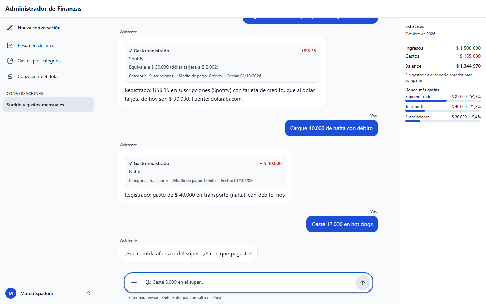
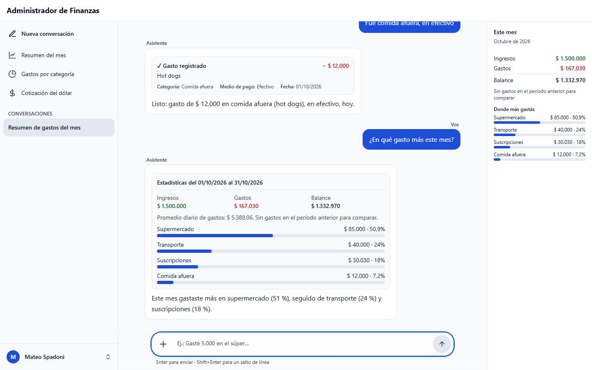
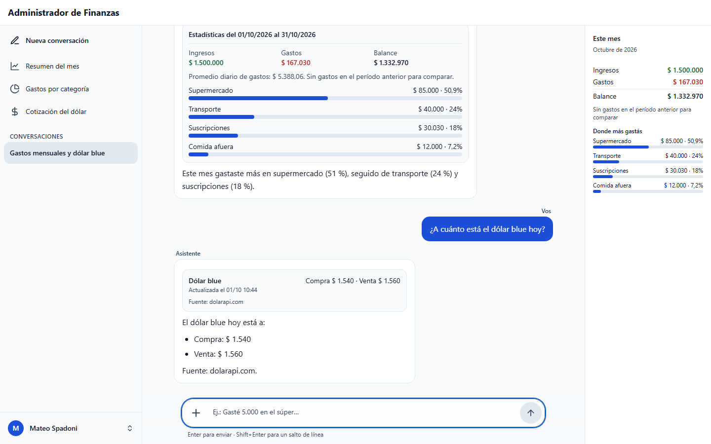
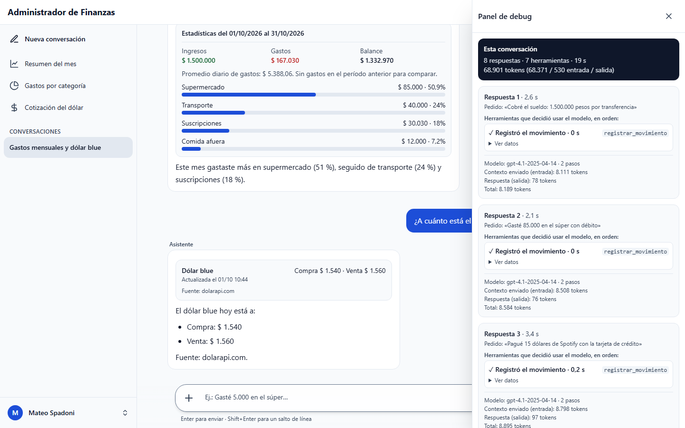
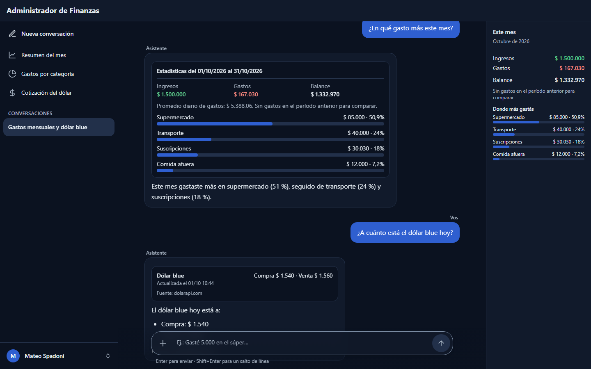
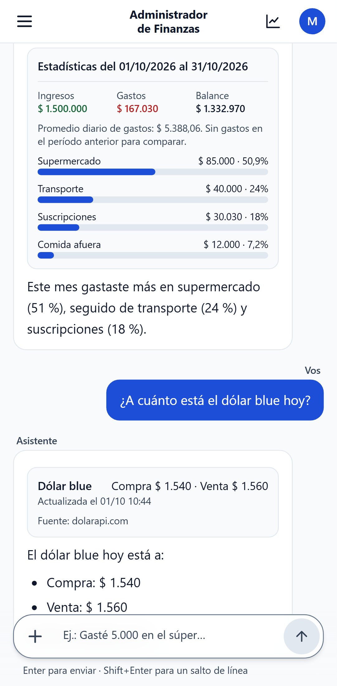
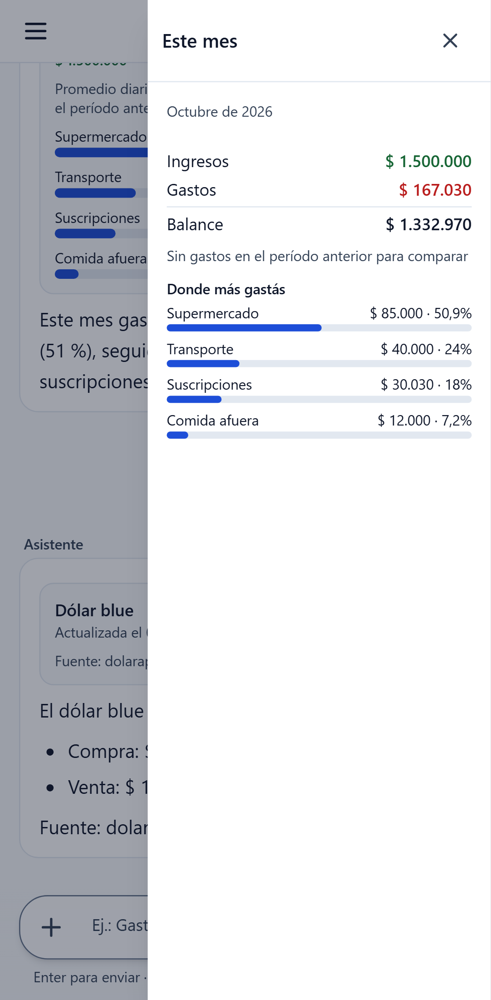

# Capturas

Una charla real con el asistente (OpenAI `gpt-4.1` y cotizaciones reales de dolarapi.com).

[← Volver al README](../README.md)

## 1. Registrar gastos conversando

Cada gasto queda como una tarjeta, y el panel «Este mes» se actualiza solo.

## 2. Pregunta lo que falta

Con «hot dogs» la categoría es ambigua y falta el medio de pago: pregunta antes de registrar.

## 3. Estadísticas del mes

Los números los calcula el código con los datos de la base, no el modelo.

## 4. El dólar, con la fuente

## 5. Panel de debug

Qué herramientas usó el modelo en cada respuesta, con sus datos, tokens y demora.

## 6. Tema oscuro

## 7. En el celular

## 8. «Este mes» en el celular

